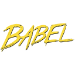

### Hi, I'm Gustavo   👋💻 :adult:

I am starting to make my portfolio where I will be uploading my projects that I have done throughout my career.

https://elmergustavo.github.io/

# Redes sociales:

  <i>Let's connect and chat! Open to anything under the sun.</i>

  

       
    
  
  
    
    
  

 

<h3> 👨🏻‍💻 &nbsp;About Me </h3>

<!-- 
  -->

- 🤔 &nbsp; Exploring new technologies and developing software solutions and quick hacks.
- 🎓 &nbsp; I study computer science and systems engineering at the Rafael Landívar University.
- 🌱 &nbsp; Learning more about Cloud Architecture, Systems Design and Artificial Intelligence.
- ✍️ &nbsp; Pursuing Graphic Design and Blog Writing as hobbies/side hustles.

<h3> 🛠 &nbsp;Tech Stack</h3>

<h2 style="margin: 1rem 0;">📚 My Stack<h3>

 
 
 
 

 
 
 
 
 
 
 
 

  ✨✨✨✨✨✨✨✨✨✨✨✨✨✨✨✨✨✨✨✨✨✨✨

  
&nbsp;

 

<!--
**elmergustavo/elmergustavo** is a ✨ _special_ ✨ repository because its `README.md` (this file) appears on your GitHub profile.

Here are some ideas to get you started:

- 🔭 I’m currently working on ...
- 🌱 I’m currently learning ...
- 👯 I’m looking to collaborate on ...
- 🤔 I’m looking for help with ...
- 💬 Ask me about ...
- 📫 How to reach me: ...
- 😄 Pronouns: ...
- ⚡ Fun fact: ...
-->
